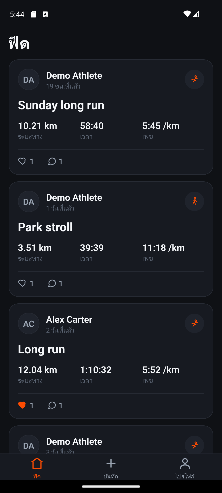
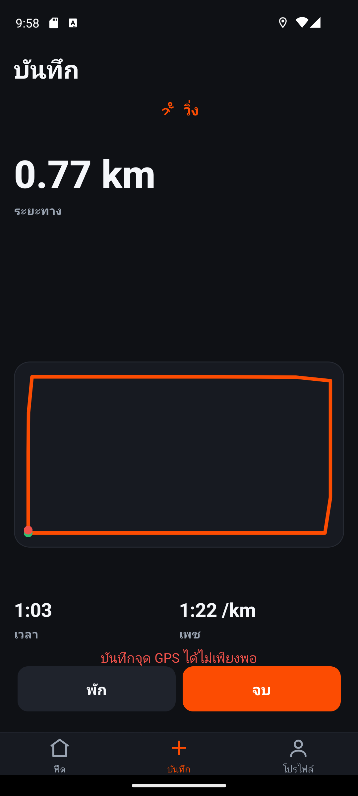

# Stravy


A Strava-like fitness tracking app. Record runs, rides, and walks with continuous GPS, then explore each activity on a route map with pace and speed charts, follow other athletes, and give kudos and comments.

It is a full-stack monorepo built to production shape: an **Expo React Native** mobile app, a **NestJS** API, and **PostgreSQL + PostGIS** for geospatial data. The data layer is **raw parameterized SQL via `pg` (no ORM, no query builder)**, and the whole stack runs from a single `docker compose up`.

---

## Screenshots

<table>
  <tr>
    <td align="center"><br/><b>Feed</b><br/><sub>Activities from you and athletes you follow, with kudos and comments</sub></td>
    <td align="center"><br/><b>Live recording</b><br/><sub>Continuous GPS with a route drawn as you move</sub></td>
    <td align="center"><br/><b>Sign in</b><br/><sub>Email and password with JWT auth</sub></td>
  </tr>
</table>

> More screens to add: the activity detail (custom route map + speed chart), profile, and settings. Drop `activity-detail.png`, `profile.png`, and `settings.png` into `docs/screenshots/` to extend the gallery above.

---

## What this project demonstrates

- **Cross-platform mobile engineering** in TypeScript: typed navigation, type-safe internationalization (English/Thai), a token-backed auth layer with transparent refresh, and a hand-built dark design system.
- **Geospatial backend with PostGIS**: GPS tracks stored as `geography(Point)` samples and summarized into a `geography(LineString)` route, both GIST-indexed.
- **A hand-written SQL data layer** — no ORM. All SQL is confined to repository classes behind a thin pool wrapper, including transactional bulk inserts and keyset pagination.
- **Production-shaped authentication**: short-lived JWT access tokens plus single-use, rotating refresh tokens that are stored only as SHA-256 hashes.
- **Dependency-free data visualization**: the route map and the speed chart are custom `react-native-svg` components — no map SDK, no API key, no charting library.
- **Clean, layered architecture**: Controller -> Service -> Repository per feature, DTO validation, and privacy rules enforced inside the data layer.
- **Operable from day one**: one-command Docker Compose stack, automatic SQL migrations on boot, a realistic demo seed, and unit tests on the backend logic.

---

## Features

### Accounts and auth
- Email/password sign-up and sign-in; passwords hashed with bcrypt.
- JWT access token (15 min) with automatic, single-flight refresh on `401`, and a refresh token (30 days) that rotates on every use.
- Profile editing: rename inline, upload an avatar from the OS image picker, set weight, units, and default privacy.

### Recording
- Continuous GPS tracking with **manual-only** start / pause / resume / finish (no auto-pause).
- Live distance, moving time, and pace-or-speed updating every second, plus a route that draws itself as you move.
- Run / ride / walk activity types; pace is shown for run and walk, speed for ride.
- On finish, the track is posted to the API, which computes the summary metrics and builds the route.

### Activity detail
- Route map rendered from the raw GPS track.
- Speed-over-time chart computed client-side from point-to-point haversine distance.
- Six metrics: distance, moving time, elapsed time, average pace/speed, max speed, and calories.
- Kudos and comments with optimistic UI (instant feedback, rollback on error).
- Owner-only delete, and GPX export from the API.

### Social feed
- A cursor-paginated feed of your own and followed athletes' activities.
- Infinite scroll and pull-to-refresh, with id-based de-duplication of pages.
- Follow / unfollow, kudos, and comments across users.

### Privacy
- Per-activity visibility: **public**, **followers-only**, or **private**, defaulting from a per-user preference.
- Enforced in SQL for lists and the feed, and in the service layer for single-item reads.

### Internationalization and design
- Full English and Thai translations; the device locale picks the initial language and the choice is persisted.
- Type-safe i18n: English keys generate a `TranslationKey` union, so a missing Thai string fails the type check.
- A consistent dark theme driven by token modules, with inline-SVG icons only (no icon fonts, no emoji).

---

## Tech stack

| Layer | Technology |
|---|---|
| Mobile | Expo ~51, React Native 0.74, React 18, TypeScript ~5.3 |
| Navigation | React Navigation v6 (native-stack + bottom-tabs), fully typed param lists |
| Mobile native modules | expo-location (GPS), expo-image-picker, expo-localization, AsyncStorage, react-native-svg |
| API | NestJS 10, Passport (passport-jwt), `@nestjs/jwt`, class-validator / class-transformer |
| Data access | `pg` 8 (raw parameterized SQL, no ORM) |
| Database | PostgreSQL 16 + PostGIS 3.4 |
| Auth | JWT access tokens + rotating, hashed refresh tokens; bcryptjs |
| Tooling | Docker Compose, Jest (backend), TypeScript strict, ESLint-friendly no-comment style |

---

## Architecture

```
mobile/  Expo React Native app (TypeScript)
   |
   |  REST over HTTP, JWT Bearer access token
   |  single typed API client with transparent 401 -> refresh -> replay
   v
server/  NestJS API
   |  feature modules, each: Controller -> Service -> Repository
   |  Controller  HTTP routing, DTO validation, guards
   |  Service     business logic, authorization, response mapping
   |  Repository  ALL SQL lives here (raw, parameterized, transactional)
   v
PostgreSQL 16 + PostGIS 3.4
   activities.route          geography(LineString, 4326)   (GIST indexed)
   activity_points.location  geography(Point, 4326)         (GIST indexed)
```

- **Monorepo** with two apps: `mobile/` (Expo) and `server/` (NestJS), plus `server/db/` SQL migrations.
- **Three-layer modules** on the server (`auth`, `users`, `activities`, `follows`, `kudos`, `comments`, `feed`, `health`) with shared `db`, `storage`, `config`, and `common` infrastructure.
- **Authentication**: a global `JwtAuthGuard` protects every feature endpoint except the public auth routes and the health probe. Access tokens carry only the user id; refresh tokens are random 48-byte secrets whose SHA-256 hash is the only thing persisted, consumed atomically via `UPDATE ... RETURNING` so they cannot be replayed.
- **Privacy** is keyset-filtered in SQL for the feed and activity lists (followers checked with an `EXISTS` over the `follows` graph) and re-checked in the service layer for single-activity reads.
- **Validation**: a global `ValidationPipe` (`whitelist` + `forbidNonWhitelisted` + `transform`) on every DTO, with `ParseUUIDPipe` on id route params.

### Notable implementation details

- `mobile/src/features/record/useTracker.ts` - the manual GPS tracker hook: ref-mirrored state for the location callback, 1s moving-time timer, incremental haversine distance, and clean subscription teardown.
- `mobile/src/components/RoutePreview.tsx` - the SVG route map: equirectangular projection with cosine-of-latitude longitude correction, auto-fit and centered into the measured container.
- `mobile/src/lib/api.ts` - the API client: in-memory token cache, single-flight refresh promise so concurrent `401`s share one refresh, and automatic sign-out on hard failure.
- `server/src/activities/activities.repository.ts` - transactional create: insert the activity, bulk-insert points in 500-row chunks, then build the route with `ST_MakeLine(... ORDER BY seq)`.
- `server/src/activities/activity-metrics.ts` - server-side distance, elevation gain, average/max speed, and MET-based calorie estimation (unit-tested).

---

## Data model

All foreign keys cascade on delete; `users` and `activities` are the hub entities.

| Table | Purpose |
|---|---|
| `users` | Accounts, profile, physical stats, per-user units and default privacy |
| `refresh_tokens` | Refresh-token records (SHA-256 hash only) with expiry and revocation |
| `activities` | One workout: summary metrics, privacy, and the `geography(LineString)` route |
| `activity_points` | Ordered raw GPS samples as `geography(Point)` with optional sensor data |
| `activity_photos` | Photos attached to an activity (stored file URL) |
| `follows` | Directed follow graph; composite PK, blocks self-follows |
| `kudos` | One like per user per activity (composite PK) |
| `comments` | Activity comments, ordered chronologically |

Migrations live in `server/db/migrations/*.sql` and are applied in filename order by a runner that records each file in a `_migrations` table and wraps every migration in its own transaction.

---

## API

The API is served under a global `/api` prefix (the health probe is the exception). All endpoints require a Bearer access token unless marked public.

<details>
<summary><b>Full endpoint reference</b></summary>

| Method | Path | Auth | Purpose |
|---|---|---|---|
| POST | `/api/auth/register` | public | Create account, returns user + token pair |
| POST | `/api/auth/login` | public | Authenticate, returns user + token pair |
| POST | `/api/auth/refresh` | public (refresh token) | Rotate refresh token, issue a new pair |
| POST | `/api/auth/logout` | auth | Revoke the supplied refresh token |
| GET | `/api/users/me` | auth | Get own profile |
| PATCH | `/api/users/me` | auth | Update name, weight, height, units, default privacy |
| POST | `/api/users/me/photo` | auth | Upload/replace avatar (multipart) |
| GET | `/api/users/search` | auth | Search users by display name |
| GET | `/api/users/:id` | auth | Get a public profile |
| POST | `/api/users/:id/follow` | auth | Follow a user |
| DELETE | `/api/users/:id/follow` | auth | Unfollow a user |
| GET | `/api/users/:id/followers` | auth | List followers |
| GET | `/api/users/:id/following` | auth | List following |
| POST | `/api/activities` | auth | Create activity from track points |
| GET | `/api/activities` | auth | List a user's activities (cursor-paginated) |
| GET | `/api/activities/:id` | auth | Activity detail with kudos/comment counts |
| PATCH | `/api/activities/:id` | auth | Update title/privacy (owner only) |
| DELETE | `/api/activities/:id` | auth | Delete activity (owner only) |
| GET | `/api/activities/:id/points` | auth | Ordered track points |
| GET | `/api/activities/:id/gpx` | auth | Export as GPX 1.1 |
| POST | `/api/activities/:id/photos` | auth | Upload a photo (owner only) |
| GET | `/api/activities/:id/photos` | auth | List photos |
| POST | `/api/activities/:id/kudos` | auth | Give kudos |
| DELETE | `/api/activities/:id/kudos` | auth | Remove kudos |
| GET | `/api/activities/:id/kudos` | auth | List who gave kudos |
| POST | `/api/activities/:id/comments` | auth | Add a comment |
| GET | `/api/activities/:id/comments` | auth | List comments |
| DELETE | `/api/comments/:id` | auth | Delete a comment (author or activity owner) |
| GET | `/api/feed` | auth | Feed of own + followed users' activities |
| GET | `/health` | public | Liveness probe (`SELECT 1`) |

</details>

---

## Running locally

### Prerequisites
- Node.js 20+
- Docker Desktop (for PostgreSQL + PostGIS)
- Android Studio (emulator) or a physical phone with Expo Go

### Option A - full stack with Docker

```bash
cp .env.example .env
docker compose up --build
```

This starts PostgreSQL + PostGIS and the API together. The API container runs migrations automatically on boot, then serves on http://localhost:3000 (health: `GET /health`).

### Option B - local dev

```bash
# database only
cp .env.example .env
docker compose up -d postgres

# API
cd server
npm install
npm run migrate
npm run dev          # http://localhost:3000

# mobile (in another terminal)
cd mobile
npm install
npm run android      # or: npm run start, then press a / i / w
```

### Reaching the API from the device

The mobile app reads `EXPO_PUBLIC_API_URL`. If unset it defaults to `http://10.0.2.2:3000`, which is the **Android emulator's** alias for the host machine.

```bash
# Android emulator (default - usually nothing to set)
EXPO_PUBLIC_API_URL=http://10.0.2.2:3000 npm run android

# Physical phone on the same Wi-Fi: use the PC's LAN IP
EXPO_PUBLIC_API_URL=http://192.168.1.50:3000 npm run start
```

> Do not point the emulator at `http://localhost:3000` - on the device, `localhost` is the device itself, not your PC.

### Demo data

```bash
cd server
node scripts/seed-demo.mjs
```

Creates two athletes who follow each other, each with realistic generated runs, rides, and walks plus kudos and comments. Re-run any time to reset.

| Email | Password |
|---|---|
| `demo@stravy.app` | `stravydemo` |
| `alex@stravy.app` | `stravydemo` |

---

## Testing

```bash
cd server
npm test           # Jest unit tests (services + activity metrics + GPX)
npm run typecheck

cd ../mobile
npm run typecheck
```

---

## Project structure

```
stravy/
  mobile/                 Expo React Native app
    src/
      features/           auth, feed, record, activity, profile, settings
      components/          reusable UI (RoutePreview, LineChart, ActivityCard, ...)
      navigation/         typed navigators (auth-gated tabs + modal stack)
      lib/                api client, endpoints, types, formatting, geo
      i18n/               type-safe English/Thai translations
      theme/              color/spacing/typography tokens
      icons/              inline-SVG icon components
  server/                 NestJS API
    src/
      auth/ users/ activities/ follows/ kudos/ comments/ feed/   feature modules
      db/ storage/ config/ common/                               infrastructure
    db/migrations/        raw SQL migrations
  docker-compose.yml
```

---

## Conventions

- Data access is raw parameterized SQL via `pg`; SQL lives only in `*.repository.ts`.
- GPS tracking is continuous with no auto-pause (manual start/pause/resume/stop).
- Icons are inline SVG only; no icon fonts, no emoji anywhere.
- Code is written without comments; names and structure carry the meaning.
